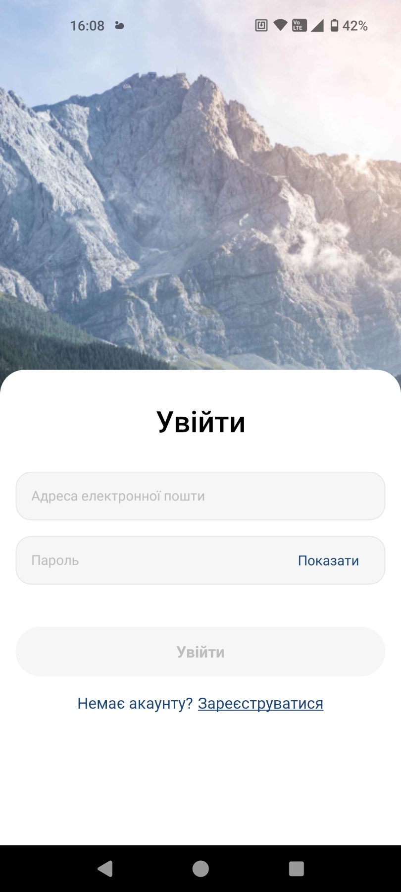

# Photo Gallery App

Welcome to the Photo Gallery App! 📸

This is a photo gallery app built with Expo, where users can register, upload their photos, and interact with them. Users have the ability to like and comment on photos shared by others. The app is powered by **Redux**, **Firebase Authentication**, **Firestore Database**, and **Firebase Storage**.

## Features
- **User Authentication**: Register and log in to manage your photos using Firebase Authentication.
- **Upload Photos**: Share your pictures with the community by uploading them to Firebase Storage.
- **Like and Comment**: Engage with other users' photos by liking and commenting, with data stored in Firestore Database.
- **Photo Feed**: View all the photos posted by users in a beautifully displayed feed, managed by Redux for efficient state management.

## Technologies Used
- **Expo**: For building and running the app.
- **Redux**: For state management, ensuring smooth and responsive app behavior.
- **Firebase Authentication**: To handle user sign-up, login, and authentication.
- **Firebase Firestore**: For storing and retrieving photo metadata, likes, and comments.
- **Firebase Storage**: For storing the actual photo files.

## Gallery

Here are some sample images from the app:

<div style="display: flex; gap: 50px;">
  
  
  
  
  
</div>

## Getting Started

### 1. Install Dependencies
Before you can start using the app, make sure to install all the required dependencies:

```bash
npm install
```

### 2. Start the App
Once the dependencies are installed, you can start the app with the following command:

```bash
npx expo start
```
